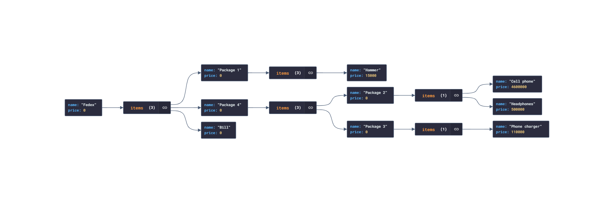

# **pattern_composite**

# Diagrama de clases

                    +---------------+
                    |   Product     |
                    +---------------+
                    | - name:str    |
                    | - price:float |
                    +---------------+
                    | + display()   |
                    | + get_price() |
                    +---------------+
                           ^
                           |
             +-------------+-------------+
             |                           |
    +---------------------+    +-----------------+
    |   Package           |    |    SingleItem   |
    +---------------------+    +-----------------+
    | - name:str          |    | - name:str      |
    | - items:List        |    | - price:float   |
    +---------------------+    +-----------------+
    | + add_item(Product) |
    +---------------------+

# Estructura Json de los datos de ejemplo

```
{
    "name": "Fedex",
    "price": 0,
    "items": [
      {
        "name": "Package 1",
        "price": 0,
        "items": [
          {
            "name": "Hammer",
            "price": 15000
          }
        ]
      },
      {
        "name": "Package 4",
        "price": 0,
        "items": [
          {
            "name": "Package 2",
            "price": 0,
            "items": [
              {
                "name": "Cell phone",
                "price": 4600000
              },
              {
                "name": "Headphones",
                "price": 500000
              }
            ]
          },
          {
            "name": "Package 3",
            "price": 0,
            "items": [
              {
                "name": "Phone charger",
                "price": 110000
              }
            ]
          }
        ]
      },
      {
        "name": "Bill",
        "price": 0
      }
    ]
  }
```


[Estructura_Json](estructura_ejemplo.json)